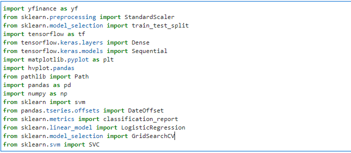
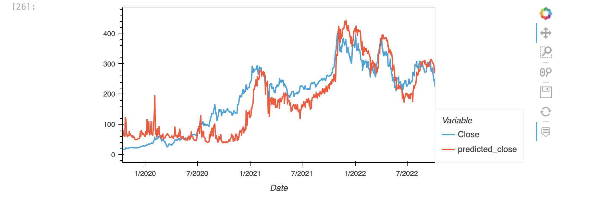
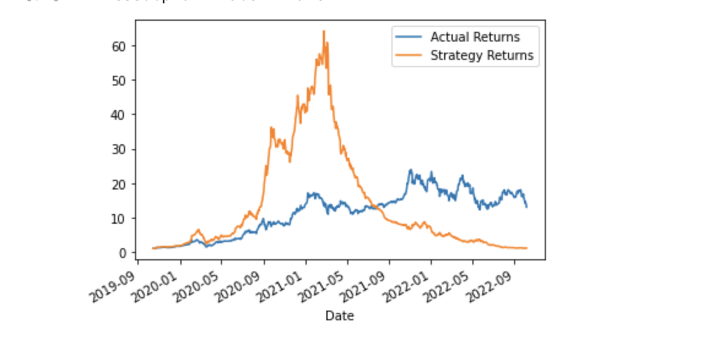
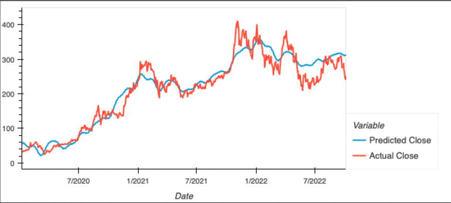
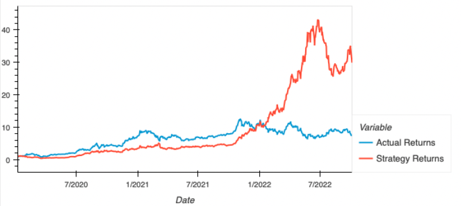

# Trading_With_Machine_Learning

___
The purpose of this group project is to compare various machine learning models to determine which is ideal to predict stock prices and to develop a trading strategy based on the model.

Our group compared a Sequential Neural Network, Facebook Prophet, XGBoost, Logistic Regression, and Support Vector Machine (SVM). In order to compare the different models to each other, we utilized the Tesla stock data for each of the models. Given more time, we would utilize additional stocks.

Based on our testing, we found the Sequential Neural Network and Facebook Prophet were the ideal to work with and produced the best results.

---

## Technology

As a group, we split our tasks into sections and used multiple Jupyter Notebooks. As each included multiple libraries and dependencies, following are three snippets presenting these libraries and dependencies.

In general, we imported our data using Yahoo Finance or yfinance. One can install using the following command - "pip install yfinance". Use the following command to install Facebook Prophet - "pip install prophet".

---

## Analysis

The analysis was mainly split into four Jupyter Notebook files:

I) tsla_project_2.ipynb

II) Tesla_Prophet.ipynb

III) machine_learning_trading.ipynb

IV) tsla_xgb_pred.ipynb

- In general, each of the notebooks had the following steps:

We imported Tesla data using yfinance, including the standard variables - Open, High, Low, Close, Volume, Dividends, Stock Splits. Then we cleaned the data, removing unnecessary columns. Additional steps that were common among each notebook included scaling input data and splitting it into training and testing sets. The following is a brief explanation for each notebook:

- I) tsla_project_2.ipynb

This notebook included our analysis utilizing the Sequential Neural Network.  In addition to the general steps, we added three columns for exponential moving averages and another for the relative strength index (RSI). Once we processed the data, we created a Sequential Neural Network using four hidden layers consisting of 50, 25, 12, and 6 nodes respectively and one output neuron. 

We then utilized our machine learning model to predict the Tesla close price for our entire data set. The following image illustrates the actual tesla price vs the predictions over three years. 

Once we obtained the predictions, we coded in a trading strategy to buy when the predicted returns were greater than or equal to 0 and sell when the predicted returns were less than 0. The following image illustrates the strategy returns compared to actual returns if one was to buy and hold a share of Tesla stock.

- II) Tesla_Prophet.ipynb

As was the case with the previous notebook, we used yahoo finance to import the data for tesla. We then cleaned up the data and including the steps described with the general steps. In order to run the model, we changed the name of the "Date" column to "ds" and the name of the "Close" column to "y". We then used these to train the model on the close price until May 2022. However, we predicted the close price until October 2022. The predicted close price was then used in the trading strategy to see how this model performed compared to the Sequential Neural Network model. The following image illustrates the Closing Prices compared to the Predicted prices.

Once we were comfortable with the model, we compared the strategy returns to the actual returns. The following image illustrates our results. 

- Notebooks III (machine_learning_trading.ipynb) and IV (tsla_xgb_pred.ipynb) can be found in the "Trial_and_Error" folder. We did not use the XGBoost model because it was overfitted and did not produce realistic strategy returns. Further, we did not use the SVM model and the Logistic Regression model because these produced good predictions of when to short the Tesla stock, however, were unreliable when it came to buying the stock. 

---

## Next Steps

Given the time constraints and the limited resources we had for this proect, we identified a few "Next Steps" in case we decide to take this project further. Following is a list of the steps we identified:

1) Enable coding to use multiple stocks. 
2) Work on improving the additional unused models - XGBoost, Logistic Regression, and SVM, in order to find ideal parameters.
3) Utilize AWS to create a stock information and prediction bot with the various models. 
4) Upload the models to Alpaca API and try paper trading to further test and see how they perform.
5) Research fundamentals of how the models generate price predictions.

---

## Contributors

Yuvraj Kabra - kabrayuvraj@gmail.com

Nirav Mehta - nm7293@gmail.com

Sebastian Sandoval - ssandoval1994r@gmail.com

Franco Thomas - francothomas1989@gmail.com

---